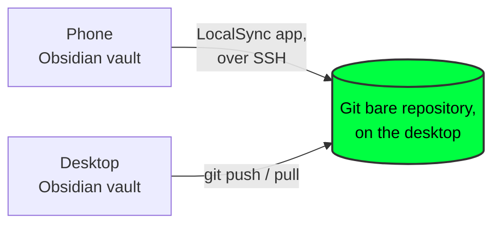
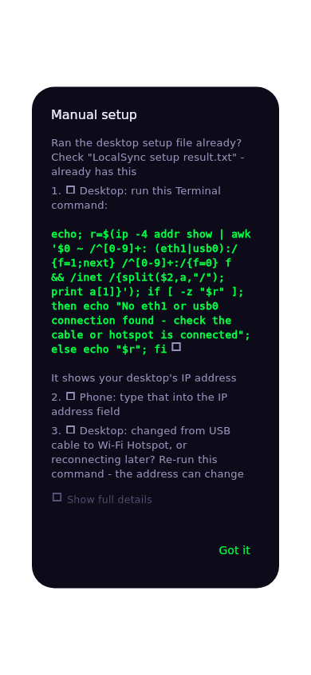
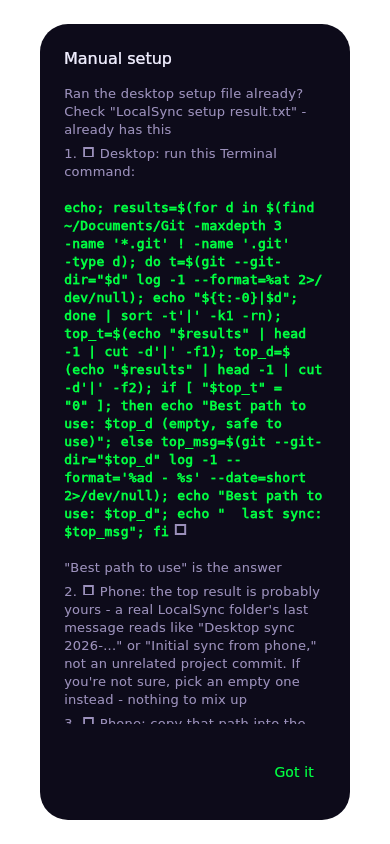
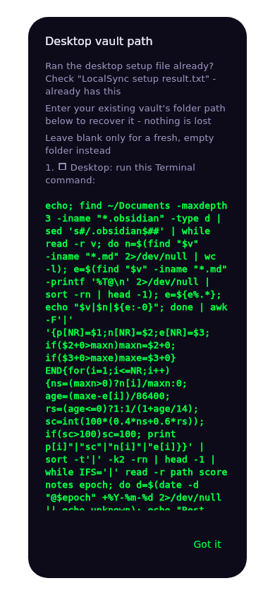

# Desktop setup for LocalSync

LocalSync syncs a phone's Obsidian vault to a folder on a desktop computer over the local network (Wi-Fi hotspot, the same Wi-Fi network, or USB tether) - nothing goes through a third-party server.

Obsidian is a PKM (personal knowledge management) app LocalSync supports today;
Logseq and other PKMs are a longer-term direction, not built yet.
- this guide is accurate to what LocalSync actually does right now.

2 things needed on the desktop before linking a vault in LocalSync:
- **Git**
- **SSH access**

The Git bare repository itself no longer needs a manual step (2026-08-28) - LocalSync creates it on the desktop automatically, the first time it pairs, over the same SSH access pairing already sets up. Nothing to run by hand unless you want a specific existing path reused (see [Git bare repository](#-3-git-bare-repository) below).

This guide covers Debian-based Linux (Linux Mint, Ubuntu, Raspberry Pi 5, and similar) and macOS.

**Automated option**: does everything below automatically - git, SSH, the bare repository, and auto-discovery. Nothing to install first - just bash, sudo, and the OS's own package manager, all already on the machine. Idempotent (safe to re-run, only changes what's actually missing), real-device tested on this exact Pi.

Three ways to run the same script, pick whichever matches how comfortable you are with a terminal:

1. **Comfortable with a terminal** (Linux or macOS) - downloads, verifies the SHA256 checksum, then runs (2026-09-01: real feedback - "download needs security and credibility... checksum like Linux Mint" - this is that, without the separate manual-comparison step Mint's own process needs):
   ```
   curl -fsSL https://raw.githubusercontent.com/eiger3970/localsync/main/desktop/setup.sh -o /tmp/localsync-setup.sh && echo "631c77ec7d88b21b3d0093094ae518961bed2bc797586f8bf54d745f4a1517c2  /tmp/localsync-setup.sh" | sha256sum -c - && bash /tmp/localsync-setup.sh
   ```
   `sha256sum -c -` refuses to continue (the `&&` chain stops) if the download doesn't match - the same tamper/corruption protection as comparing a published checksum by hand, just automatic. Skip the auto-discovery step: append ` --skip-discovery` after `/tmp/localsync-setup.sh` in the final command.

   Prefer the plain, unverified one-liner anyway? `curl -fsSL https://raw.githubusercontent.com/eiger3970/localsync/main/desktop/setup.sh | bash` still works the same as always - the checksum version above is the one actually recommended.

2. **Prefer double-clicking a file** (2026-09-01: real feedback - "terminal is an unknown for some users... a double click install file is needed for GUI only users unfamiliar with CLI or TUI"):
   - macOS: download [`LocalSync-Setup-Mac.command`](https://kworld.space/localsync/LocalSync-Setup-Mac.command), double-click it in Finder. It opens Terminal and runs the same script - the first time, macOS's Gatekeeper will ask you to confirm you trust it (right-click → Open, instead of double-click, if it refuses the first time). It's a thin, self-verifying wrapper, not a separate copy of the logic - it fetches the real, current `setup.sh` from GitHub (checksummed before running, see above), so it can never go stale or run something tampered with.
   - Linux: no double-click file - **confirmed live 2026-09-01**, a downloaded `.desktop` launcher got renamed by Firefox to `...desktop.download` on save, since that file type is a recognized Linux executable-launcher and browsers deliberately flag/rename that class of download as a safety measure. That's not fixable across browsers, and a renamed, broken-looking file is worse than no download at all. Use the terminal one-liner above instead - it's one line either way.

3. **Already have Ansible and prefer it**: `desktop/setup.yml` does the same steps as a playbook: `ansible-playbook desktop/setup.yml` (skip discovery with `--skip-tags discovery`) - source only, not hosted on the website, since anyone choosing this option already has the repo.

On macOS the script also installs a persistent LaunchDaemon for auto-discovery (survives a reboot, unlike the manual `dns-sd -R` command further down this guide). Windows isn't covered - no native SSH-by-default, no apt/brew equivalent, a genuinely separate problem, not an oversight.

## No desktop computer? A NAS works too

LocalSync's actual requirement is "an always-on, SSH-reachable machine that can run git" - a traditional desktop is the common case, but not the only one:

- **A Raspberry Pi** (this guide's own reference platform) is the cheapest way to get one from scratch - roughly the price of the SPV Stack hardware this same site already sells, optionally paired with an external SSD/enclosure for extra storage.
- **A NAS** (Synology, QNAP, and similar) already runs a Linux-based OS and is already always-on - often a *better* fit than a laptop that sleeps. Both major brands support this with no new code needed here, since LocalSync just needs SSH + git, the same as any other target:
  - Synology: DSM → Control Panel → Terminal & SNMP → enable SSH. Install "Git Server" from Package Center for git.
  - QNAP: QTS → Control Panel → Network & File Services → Telnet/SSH → enable SSH. Install "Git" from App Center.
  - `desktop/setup.sh` targets Debian/macOS package managers specifically and won't run as-is on DSM/QTS - follow your NAS's own steps above for git+SSH, then just point LocalSync's Settings at the NAS's IP and a path for the bare repo (created the same automatic way on first pairing, over SSH, regardless of what's on the other end).
- **A bare external SSD/enclosure on its own does not work** - it has no CPU, no OS, no network stack, nothing to SSH into. It only helps as *storage attached to* one of the above.



The Git bare repository is the thing both sides (desktop and phone) actually sync through - not a normal folder with files in it, just git history.

Neither device talks to the other directly, and a second synced copy of the vault's text notes is itself a convenient backup - if one device is lost or fails, the other still has everything (binary attachments aren't covered by this - kept out of scope here deliberately).

The desktop side of the sync (the `git push / pull` step above) is automated via `desktop/localsync_sync.sh` - see [Desktop-side sync automation](#-desktop-side-sync-automation) below. As of 2026-08-30 the phone app installs and schedules it itself during pairing; nothing to set up by hand for a normal setup.

If both are already set up (git is installed, SSH is reachable), skip to [Settings values](#settings-values).

## 🌿 1. Git

**Debian-based Linux (Linux Mint, Ubuntu, Raspberry Pi 5, and similar)** - usually already installed. Check and install if missing:
```
git --version
sudo apt update && sudo apt install -y git
```

**macOS** - installing the Xcode Command Line Tools installs git:
```
git --version
```
If that prompts an install of developer tools, accept - git comes with it, no separate download needed.

## 🔐 2. SSH access

LocalSync's phone-to-desktop sync runs entirely over SSH. Pairing (the one-time step that authorizes a phone) also connects over SSH, using the desktop login password - SSH needs to be running before pairing.

**Debian-based Linux** - SSH server isn't installed by default:
```
sudo apt install -y openssh-server
sudo systemctl enable --now ssh
```

**macOS** - the SSH server is built in, just switched off by default:
- **System Settings → General → Sharing → Remote Login** → turn on.
- Optionally, restrict it to one user account rather than "All users."

**Either platform** - confirm the desktop login password will work over SSH (needed for pairing specifically, not for ongoing sync):
```
grep -i passwordauthentication /etc/ssh/sshd_config
```
If it says `PasswordAuthentication no`, change it to `yes`, then restart SSH (`sudo systemctl restart ssh` on Linux; toggle Remote Login off/on on macOS). This can go back to `no` after pairing once, if preferred - ongoing sync uses the key pairing installs, not the password.

## 📦 3. Git bare repository

**Automatic as of 2026-08-28** - the first time LocalSync pairs with this desktop, it creates the bare repository itself at whatever path is typed into Settings, using the SSH access pairing just installed (`git_service.dart`'s `_ensureBareRepoExists()`). Nothing to run here by hand for a fresh setup.

A single, recommended path if the Settings field is otherwise empty - no need to decide this from scratch:
```
/home/username/Documents/Git/LocalSync/vault.git
```
(macOS: `/Users/username/Documents/Git/LocalSync/vault.git`)

Type the **full absolute path** into LocalSync's Settings; the folder and bare repo both get created automatically if they don't already exist. Only run `git init --bare <path>` by hand if pointing at a specific path you've already created for another reason - the automatic step is idempotent and never touches a bare repo that already exists.

## 📡 Auto-discovery (optional)

The desktop's IP address is the one setting that genuinely drifts - it changes every time the phone switches between USB tether and Hotspot Wi-Fi. This step lets LocalSync find it automatically instead of typing it in by hand each time. Skip this section entirely and enter the IP manually if preferred - it's optional, not required for the app to work.

**Debian-based Linux**:
```
sudo apt install -y avahi-daemon
sudo systemctl enable --now avahi-daemon
sudo cp desktop/localsync.service /etc/avahi/services/
```
The service file (`desktop/localsync.service` in this repo) advertises the desktop as `_localsync._tcp` on port 22 - change the port inside the file first if SSH runs somewhere else.

**macOS**: Bonjour is built in, no install needed. Advertise the service ad-hoc for testing:
```
dns-sd -R "LocalSync" _localsync._tcp local 22
```
This only lasts while that terminal command keeps running - a persistent version needs a LaunchDaemon, not covered here yet.

In LocalSync's Settings, tap the 📡 icon next to **IP address - desktop** to search - if the desktop is reachable and advertising, its address fills in automatically.

## ⚙️ Settings values

LocalSync's kebab menu → **Settings** has four fields. If you ran the automated setup file above, its output already answers all four - username, IP address, sync folder, and vault path - nothing to look up separately. Each field's ⓘ button also shows the same answer as a fallback:



**IP address - desktop** - or tap the 📡 icon to auto-find it instead of typing.



**Git bare repo path** - "Best path to use" if you're reconnecting to an existing sync; leave blank for a fresh one.



**Desktop vault path** (optional) - only needed to reconnect the desktop's own Obsidian vault to an existing sync.

## 🤝 4. Phone pairing

In LocalSync, follow the walkthrough: drag the phone icon onto the desktop icon → enter the desktop login password when prompted.

This is used once, over the SSH connection, to install the phone's own key into `~/.ssh/authorized_keys` on the desktop

- the password itself is never stored anywhere.

## 📓 5. Vault linking

Kebab menu → **Add another vault** (or the first-run setup flow upon install, for a first vault). For an Obsidian vault folder that already exists, use **"Already have a vault set up? Link it directly"** on the first screen to skip the from-scratch vault-creation walkthrough.

## 🔁 Desktop-side sync automation

**Automatic as of 2026-08-30** - the phone app installs `desktop/localsync_sync.sh` to `~/Documents/Scripts/` on the desktop itself, over the same SSH access pairing already sets up, and schedules it to run every 5 minutes via cron (`git_service.dart`'s `_ensureDesktopSyncInstalled()`). Nothing to copy, chmod, or configure by hand for a normal setup - this runs on every successful pull, so it also stays current if a future app update changes the script.

`desktop/localsync_sync.sh` keeps the desktop's own working copy (a real Obsidian vault open on the desktop, or just a synced folder for Tier 0) up to date against the bare repository - fetch, compare, and either fast-forward or a real three-way merge with the same conflict repair the phone app itself uses (markdown conflict callouts, Kanban-safe, and a back-up-both-keep-ours safety net for any non-text file). Real, tested against local temp repos including a same-run markdown + binary conflict; the automated SSH install itself is reasoned carefully but not yet confirmed against a real desktop.

Logs to `~/.localsync_sync.log` - check there first if a scheduled run doesn't seem to be doing anything.

### Manual setup (fallback, or if the automatic install didn't work)

```
mkdir -p ~/Documents/Scripts
cp desktop/localsync_sync.sh ~/Documents/Scripts/
chmod +x ~/Documents/Scripts/localsync_sync.sh
```

Configure via environment variables (or edit the defaults directly in the script) - they must match what's set in LocalSync's own Settings screen on the phone:
```
export LOCALSYNC_VAULT=~/Documents/LocalSync/vault        # desktop working copy
export LOCALSYNC_BARE_REPO=~/Documents/Git/localsync.git  # same path as Settings -> Git bare repo path
```

Run it by hand to test:
```
~/Documents/Scripts/localsync_sync.sh
```

To run it periodically instead of by hand, add a cron entry (`crontab -e`):
```
*/5 * * * * ~/Documents/Scripts/localsync_sync.sh
```

## 🧪 Before linking a real vault

Test the whole flow once with a throwaway Obsidian vault first - create an empty vault with nothing important in it, link it, edit a note on each side, confirm sync works both ways. Once that's confirmed working, link the real vault. This costs a few minutes and removes any guesswork about whether a first real sync is safe.

## 🛠️ Troubleshooting

LocalSync's own error dialogs (tap the vault name in the app bar, or the failure screen during setup) show a plain-language diagnosis, a fix, and - critically - the raw underlying error, so guessing shouldn't be necessary. Most connection failures trace back to one of:
- The desktop is asleep, or not on the same network as the phone right now.
- The IP address changed since it was last entered (see the Settings values section above).
- SSH isn't actually running (`sudo systemctl status ssh` on Linux; check Remote Login is on, on macOS).
