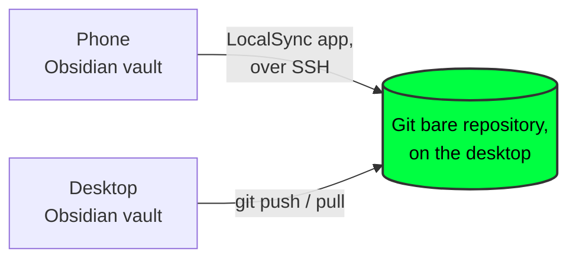

# Desktop setup for LocalSync

LocalSync syncs a phone's Obsidian vault to a folder on a desktop computer over the local network (Wi-Fi hotspot, the same Wi-Fi network, or USB tether) - nothing goes through a third-party server.

Obsidian is a PKM (personal knowledge management) app LocalSync supports today;
Logseq and other PKMs are a longer-term direction, not built yet.
- this guide is accurate to what LocalSync actually does right now.

3 installs needed before linking a vault in LocalSync:
- **Git**
- **Git bare repository**
- **SSH access**

This guide covers Debian-based Linux (Linux Mint, Ubuntu, Raspberry Pi 5, and similar) and macOS.



The Git bare repository is the thing both sides (desktop and phone) actually sync through - not a normal folder with files in it, just git history.

Neither device talks to the other directly, and a second synced copy of the vault's text notes is itself a convenient backup - if one device is lost or fails, the other still has everything (binary attachments aren't covered by this - kept out of scope here deliberately).

Today the desktop side of the sync (the `git push / pull` step above) is manual, run by hand. Nothing automated exists for it yet.

If all three are already set up (git is installed, a Git bare repository exists, SSH is reachable), skip to [Settings values](#settings-values).

## 🌿 1. Git

**Debian-based Linux (Linux Mint, Ubuntu, Raspberry Pi 5, and similar)** - usually already installed. Check and install if missing:
```
git --version
sudo apt update && sudo apt install -y git
```

**macOS** - installing the Xcode Command Line Tools installs git:
```
git --version
```
If that prompts an install of developer tools, accept - git comes with it, no separate download needed.

## 🔐 2. SSH access

LocalSync's phone-to-desktop sync runs entirely over SSH. Pairing (the one-time step that authorizes a phone) also connects over SSH, using the desktop login password - SSH needs to be running before pairing.

**Debian-based Linux** - SSH server isn't installed by default:
```
sudo apt install -y openssh-server
sudo systemctl enable --now ssh
```

**macOS** - the SSH server is built in, just switched off by default:
- **System Settings → General → Sharing → Remote Login** → turn on.
- Optionally, restrict it to one user account rather than "All users."

**Either platform** - confirm the desktop login password will work over SSH (needed for pairing specifically, not for ongoing sync):
```
grep -i passwordauthentication /etc/ssh/sshd_config
```
If it says `PasswordAuthentication no`, change it to `yes`, then restart SSH (`sudo systemctl restart ssh` on Linux; toggle Remote Login off/on on macOS). This can go back to `no` after pairing once, if preferred - ongoing sync uses the key pairing installs, not the password.

## 📦 3. Git bare repository

A single, recommended location - no need to decide this from scratch:
```
mkdir -p ~/Documents/Git/LocalSync
git init --bare ~/Documents/Git/LocalSync/vault.git
```

This exact path (adjusted for the real username) goes into LocalSync's Settings - note the **full absolute path** (e.g. `/home/username/Documents/Git/LocalSync/vault.git`, or on macOS `/Users/username/Documents/Git/LocalSync/vault.git`).

## 📡 Auto-discovery (optional)

The desktop's IP address is the one setting that genuinely drifts - it changes every time the phone switches between USB tether and Hotspot Wi-Fi. This step lets LocalSync find it automatically instead of typing it in by hand each time. Skip this section entirely and enter the IP manually if preferred - it's optional, not required for the app to work.

**Debian-based Linux**:
```
sudo apt install -y avahi-daemon
sudo systemctl enable --now avahi-daemon
sudo cp desktop/localsync.service /etc/avahi/services/
```
The service file (`desktop/localsync.service` in this repo) advertises the desktop as `_localsync._tcp` on port 22 - change the port inside the file first if SSH runs somewhere else.

**macOS**: Bonjour is built in, no install needed. Advertise the service ad-hoc for testing:
```
dns-sd -R "LocalSync" _localsync._tcp local 22
```
This only lasts while that terminal command keeps running - a persistent version needs a LaunchDaemon, not covered here yet.

In LocalSync's Settings, tap the 📡 icon next to **IP address - desktop** to search - if the desktop is reachable and advertising, its address fills in automatically.

## ⚙️ Settings values

LocalSync's kebab menu → **Settings** needs two things, both with a ⓘ help button in the app itself showing the same commands:

**IP address - desktop**
```
# Debian-based Linux
ip -4 addr show
```
```
# macOS
ipconfig getifaddr en0
```
Look for the address on whichever interface the phone actually connects through - USB tethering and Wi-Fi hotspot show up as different interfaces, and the address changes when switching between them.

**Git bare repo path** - the exact absolute path from step 3 above (written out in full, not with `~`).

## 🤝 4. Phone pairing

In LocalSync, follow the walkthrough: drag the phone icon onto the desktop icon → enter the desktop login password when prompted.

This is used once, over the SSH connection, to install the phone's own key into `~/.ssh/authorized_keys` on the desktop

- the password itself is never stored anywhere.

## 📓 5. Vault linking

Kebab menu → **Add another vault** (or the first-run setup flow upon install, for a first vault). For an Obsidian vault folder that already exists, use **"Already have a vault set up? Link it directly"** on the first screen to skip the from-scratch vault-creation walkthrough.

## 🧪 Before linking a real vault

Test the whole flow once with a throwaway Obsidian vault first - create an empty vault with nothing important in it, link it, edit a note on each side, confirm sync works both ways. Once that's confirmed working, link the real vault. This costs a few minutes and removes any guesswork about whether a first real sync is safe.

## 🛠️ Troubleshooting

LocalSync's own error dialogs (tap the vault name in the app bar, or the failure screen during setup) show a plain-language diagnosis, a fix, and - critically - the raw underlying error, so guessing shouldn't be necessary. Most connection failures trace back to one of:
- The desktop is asleep, or not on the same network as the phone right now.
- The IP address changed since it was last entered (see the Settings values section above).
- SSH isn't actually running (`sudo systemctl status ssh` on Linux; check Remote Login is on, on macOS).
